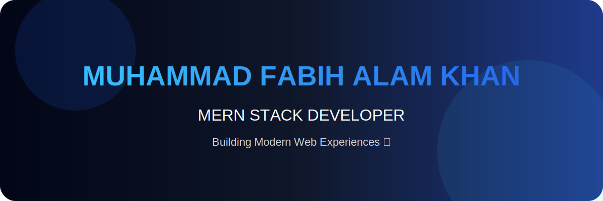

---

<div align="center">



<br/>


<br/>

<a href="https://github.com/FABIHALAM">

</a>

<a href="https://fabih.vercel.app">

</a>

<a href="mailto:fabihalam21@gmail.com">

</a>

</div>

---

## 👨‍💻 About Me

```javascript
const developer = {
    name: "Muhammad Fabih Alam Khan",

    role: "MERN Stack Developer",

    education: "BS Software Engineering",

    stack: [
        "MongoDB",
        "Express.js",
        "React.js",
        "Node.js"
    ],

    currentlyLearning: [
        "Advanced MERN",
        "System Design",
        "Cloud Deployment"
    ],

    goal:
    "Building scalable and impactful software solutions 🚀"
};
```
<div align="center">

# ⚡ Tech Arsenal

</div>

<br/>

<table align="center">
<tr>

<td width="50%" valign="top">

## 🎨 Frontend

<p>

</p>

**Specialized In:**

- Modern React Interfaces
- Responsive UI Design
- Component Architecture
- Performance Optimization
- Animation & UX

</td>

<td width="50%" valign="top">

## ⚙️ Backend

<p>

</p>

**Specialized In:**

- REST APIs
- Server Architecture
- Authentication Systems
- Backend Logic
- API Integration

</td>

</tr>

<tr>

<td width="50%" valign="top">

## 🗄️ Database

<p>

</p>

**Experience With:**

- Database Design
- Data Modeling
- Query Optimization
- Secure Data Handling

</td>


<td width="50%" valign="top">

## 🛠️ Development Tools

<p>

</p>

**Workflow:**

- Git Based Development
- API Testing
- UI Prototyping
- Deployment

</td>

</tr>

</table>

---

<div align="center">

## 🚀 Current Focus

</div>

```yaml
Learning:
  - Advanced MERN Architecture
  - System Design
  - Scalable Backend Systems
  - Cloud Deployment

Building:
  - Production Level Applications
  - Open Source Projects
  - Developer Tools

```
<div align="center">

# 🚀 Featured Projects

</div>

<br/>

<table align="center">

<tr>

<td width="50%" valign="top">

## 🔐 Digital Evidence Integrity System

A secure digital evidence verification platform focused on maintaining data integrity using cryptographic hashing.

### 🧰 Tech


### ✨ Features

- 🔒 SHA-256 Hash Verification
- 📁 Evidence Management
- 🛡 Integrity Checking
- 📊 Dashboard Interface

</td>


<td width="50%" valign="top">

## 📋 Taskly

A complete MERN Stack task management application built with modern full-stack architecture.

### 🧰 Tech


### ✨ Features

- 🔐 Authentication
- 📝 Task CRUD Operations
- ⚡ REST API
- 📱 Responsive UI

</td>

</tr>


<tr>

<td width="50%" valign="top">

## 🌐 Developer Portfolio

Personal portfolio website showcasing skills, projects and experience.

### 🧰 Tech

- React.js
- Node.js Environment
- Tailwind CSS
- Modern UI Components

### ✨ Highlights

- Responsive Design
- Smooth Animations
- Clean User Experience

</td>


<td width="50%" valign="top">

## 📊 Sales Dashboard

Business analytics dashboard designed for data visualization and insights.

### ✨ Features

- 📈 Data Visualization
- 📊 Analytics Cards
- 📱 Responsive Layout
- ⚡ Fast Interface

</td>

</tr>


<tr>

<td colspan="2" align="center">

# 🤖 AI Based Project

### 🚧 Coming Soon

Exploring Artificial Intelligence and intelligent software solutions.

</td>

</tr>

</table>

---

<div align="center">

## 💡 Building Ideas Into Reality

</div>

---

---

<div align="center">

# 📊 GitHub Analytics

</div>

<br/>

<div align="center">


</div>

<br/>

<div align="center">


</div>

---

<div align="center">

# 🏆 Achievements

</div>

<p align="center">


</p>

---

<div align="center">

# 📈 Contribution Graph

</div>

<p align="center">


</p>

---

<div align="center">

# 🧩 Developer Stats

</div>


<table align="center">

<tr>

<td>


</td>

<td>


</td>

</tr>

</table>

---

<div align="center">

### ⚡ Code. Build. Improve. Repeat.

</div>

---

---

<div align="center">

# 🐍 Contribution Snake

</div>

<p align="center">


</p>

---

<div align="center">

# 🎯 2026 Developer Roadmap

</div>


<table align="center">

<tr>

<td align="center">

### 🚀 Full Stack Growth

MERN Architecture  
Advanced Backend  
System Design

</td>

<td align="center">

### ☁️ Deployment Skills

Cloud Platforms  
CI/CD  
Production Apps

</td>

<td align="center">

### 🤝 Community

Open Source  
Collaboration  
Knowledge Sharing

</td>

</tr>

</table>

---

<div align="center">

# 🤝 Let's Connect

</div>


<p align="center">

<a href="https://www.linkedin.com/in/muhammad-fabih-alam-khan-27018b406">


</a>


<a href="mailto:fabihalam21@gmail.com">


</a>


<a href="https://fabih.vercel.app">


</a>

</p>

---

<div align="center">

## 💙 Thanks For Visiting My Profile

<br/>

### ⭐ Explore my repositories and let's build something amazing!

<br/>


</div>

---

