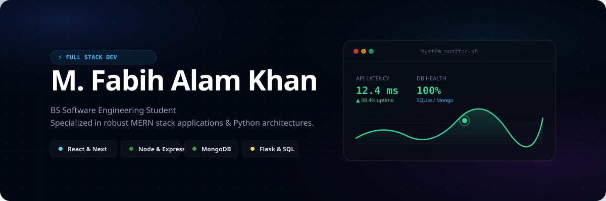

# Muhammad Fabih Alam Khan
### Full Stack Developer & Software Engineering Student

  

Hello! I'm a Software Engineering student specializing in full-stack web development. I focus on building responsive interfaces, designing clean REST APIs, and securing database-driven applications. My primary technology stack revolves around **JavaScript (MERN)** and **Python (Flask)**.

[🌐 Portfolio](https://fabih.vercel.app) • [💼 LinkedIn](https://www.linkedin.com/in/muhammad-fabih-alam-khan-27018b406) • [✉️ Email](mailto:fabihalam21@gmail.com)

---

## 🛠️ Tech Stack & Tooling

* **Languages:** JavaScript, TypeScript, Python, HTML5, CSS3, SQL
* **Frontend:** React.js, Next.js, Vite, Tailwind CSS, Vanilla CSS
* **Backend:** Node.js, Express.js, Flask (Python)
* **Databases:** MongoDB, MySQL, SQLite, Firebase
* **Tools & Workflow:** Git, GitHub, Postman, Figma, NPM, Vercel

---

## 🚀 Featured Projects

### 🔍 [Find & Loss System](https://github.com/FABIHALAM/find-and-loss-system)
A web-based Lost & Found management system built with Flask and SQLite.
* Implements a smart keyword-based matching engine to automatically link lost and found items.
* Features secure user authentication, role management (Admin & Standard User), and claim request workflows.
* Styled with a custom responsive glassmorphic dark theme.
* **Tech:** Python, Flask, SQLite, HTML5, CSS3

### 🔐 [Digital Evidence Integrity System](https://github.com/FABIHALAM/digital-evidence-integrity-system)
A secure platform focused on verifying digital evidence integrity.
* Uses cryptographic SHA-256 hash verification to confirm file states and detect tampering.
* Features a clean management dashboard for uploads and history verification.
* **Tech:** Python, Flask, Cryptography, HTML/CSS

### 📋 [Taskly](https://github.com/FABIHALAM/taskly)
A full-stack task management application with a secure MERN architecture.
* Features JWT-based user authentication, protected routes, and session persistence.
* Supports task categorization, prioritization, and real-time status sorting.
* **Tech:** React, Node.js, Express.js, MongoDB, Tailwind CSS

---

## 📊 GitHub Analytics

  
  

### 🐍 Contribution Activity

  

---

## 🤝 Let's Connect

* **LinkedIn:** [muhammad-fabih-alam-khan](https://www.linkedin.com/in/muhammad-fabih-alam-khan-27018b406)
* **Email:** [fabihalam21@gmail.com](mailto:fabihalam21@gmail.com)
* **Portfolio:** [fabih.vercel.app](https://fabih.vercel.app)
